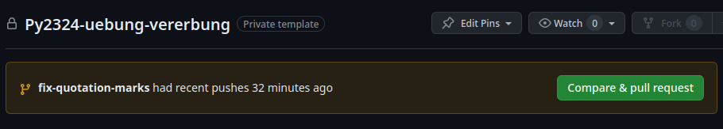

<!-- -*- coding: utf-8 -*- -->

# Arbeit mit Git

Das Tool `Git` ist ein leistungsfähiges Versionskontroll-System, welches besonders gut beim Programmieren eingesetzt werden kann.
Gerade bei Zusammenarbeit von mehreren ProgrammiererInnen ist ein Versionskontroll-System unabdingbar, da so mehrere Personen
unabhängig am gleichen Projekt arbeiten können. Es bietet aber auch für einzelne ProgrammiererInnen viele Vorteile.
Zum Beispiel lassen sich Änderungen an den Teilen des Projekts schnell inspizieren, modifizieren oder rückgängig machen.
Ausserdem kann an verschiedenen Projekt-Features unabhängig gearbeitet werden.

Jedes Programmierprojekt wird in einem `Repository` abgelegt. Dies ist ein virtueller Speicher, welches aus der Kollektion
der Dateien des Projekts und Metadata zur Versionskontrolle besteht. Jede substanzielle Code-Änderung
wird in einem `Commit` zur Projekt-Geschichte hinzugefügt und mit einer Überschrift betitelt.
`Github` ist ein internet-basierter Dienst zum Einsatz von `Git`. Beginnt man `Github` zu verwenden, sind einige Konfigurationsschritte nötig,
die im folgenden [Video](https://www.youtube.com/watch?v=kHkQnuYzwoo) erklärt werden.

## Projekt-Geschichte

Die Projekt-Geschichte lässt sich mittels

```shell
git log
```

anzeigen. Eine Beispielsausgabe:


Es ist daraus also ersichtlich, wer wann welche Commits gemacht hat und was damit bezweckt werden sollte.

## Aktueller Zustand

Der aktuelle Zustand des Git Repositories lässt sich mittels

```shell
git status
```

anzeigen. Hier wird ersichtlich, ob es geänderte Dateien gibt, ob diese bereits für einen neuen Commit vorgemerkt sind (grün statt rot) und ob gerade ein
"Merge" oder "Rebase" Prozess zur Zusammenführung von Dateien im Gange ist. Ausserdem wird der aktuelle Branch (Zweig) angezeigt, auf welchem gearbeitet wird.

Zum Beispiel zeigt:

```shell
Auf Branch main
Ihr Branch ist auf demselben Stand wie 'origin/main'.

Änderungen, die nicht zum Commit vorgemerkt sind:
  (benutzen Sie "git add <Datei>...", um die Änderungen zum Commit vorzumerken)
  (benutzen Sie "git restore <Datei>...", um die Änderungen im Arbeitsverzeichnis zu verwerfen)
 geändert:       snippets/loops.py

Unversionierte Dateien:
  (benutzen Sie "git add <Datei>...", um die Änderungen zum Commit vorzumerken)
 other/

keine Änderungen zum Commit vorgemerkt (benutzen Sie "git add" und/oder "git commit -a")
```

an, dass auf dem Hauptzweig `main` gearbeitet wird und dass es eine geänderte Datei `snippets/loops.py` gibt, die mittels `git add snippets/loops.py`
für einen Commit vorgemerkt werden kann. Auch das Verzeichnis `other/` ist neu und kann hinzugefügt werden.

## Klonen von Repositories

Um ein Repository vom Online-Dienst Github zu klonen, verwendet man den Befehl `git clone`. Bei fremden Repositories empfiehlt sich, diese zuerst
mittels `Fork` abzuzweigen, so dass man die abgezweigte Variante nicht nur lokal, sondern auch auf Github verändern kann. Ohne Abzweigung
fehlt die Berechtigung dazu.

Um etwa das `Python-2023-24` repository zu klonen, tippe in der Konsole, in welcher du `git` ausführen kannst:

```shell
git clone https://github.com/KS-Limmattal/Python-2023-24.git
```

## Änderungen bereitstellen und veröffentlichen

Anstatt die neusten Code-Dateien auf Github im Web-Interface reinzukopieren und so zu veröffentlichen, lautet der Ablauf aus der Kommandozeile wie folgt:

```shell
git add <Dateiname(n)>
git commit -m "Commit-Nachricht"
git push
```

Dabei sollte im Zweifelsfall vorher mittels

```shell
git fetch
git status
```

überprüft werden, ob der aktuelle Zweig im lokalen Repository im selben Zustand wie das online Repository ist. Ansonsten muss mittels

```shell
git pull
```

das lokale Repository mit den Änderungen im online Repository aktualisiert werden.

## Arbeit mit verschiedenen Zweigen

Der 'main' Branch repräsentiert den aktuellen Zustand mit allen akzeptierten Beiträgen
der verschiedenen Mitwirkenden. Die Mitwirkenden arbeiten dabei für einzelne Beiträge auf eigenen Zweigen, z.B.

- 'add-bad-guy-class' (ein neues Feature, welches eine Klasse 'bad-guy' in einem Spiel hinzufügt)
- 'fix-velocity' (ein Bugfix, welcher die aktuell nicht befriedigend funktionierende Geschwindigkeit korrigiert)
- 'update-readme' (ein Update des READMEs, um den aktuellen Projektstand zu beschrieben)

### Abzweigen

Um einen neuen Zweig (hier 'add-feature') vom Hauptzweig 'main' abzuzweigen, verwenden wir
den Befehl

```shell
git checkout main
git checkout -b add-feature
```

Die erste Zeile entfällt, wenn wir bereits auf dem 'main' Branch sind, was mit `git status`
überprüft werden kann. Dabei ist zu beachten, dass der Wechsel `git checkout` des Zweiges 
in der Regel nur dann möglich ist, wenn die aktuellen Änderungen commited, verworfen oder mit
`git stash` zwischengespeichert (und damit auch verworfen) worden sind. Bei Ausführung von
`git status` sollten also keine Änderungen (weder rot noch grün) aufgeführt sein.

Der Zweig kann ebenfalls mit `git push` (oder `git push origin add-feature`) auf Github
gepusht werden. 


Soll zuerst noch der `main` Zweig mit den letzten Änderungen im online Repository aktualisiert werden, so sollte noch ein `git pull` dazwischengeschaltet werden:

```shell
git checkout main
git pull
git checkout -b add-feature
```


### Pull Requests

Ist die Arbeit an dem Branch abgeschlossen (oder in fortgeschrittenem Stadium), kann man auf Github einen
"Pull Request" (abgekürzt "PR") erstellen. Dazu muss im "Pull Requests" Reiter der grüne Knopf 
"Compare & Pull Request" angeklickt werden, evtl. eine ausführlichere Beschreibung hinzugefügt
werden und dann mit dem grünen Knopf "Create Pull Request" bestätigt werden.



Nun ist es die Aufgabe eines anderen Team-Mitglieds, den Pull Request zu begutachten,
Änderungen zu verlangen (welche immer noch mit `git add`, `git commit`, `git push` am Zweig angebracht werden können) und am Schluss den Pull Request in den aktuellen Zweig zu übernehmen (grüner Knopf "Rebase and Merge" oder "Squash and Merge" unten).
Hauptunterschied:
- Bei "Squash and Merge" werden die verschiedenen Commits, die im Beitrag enthalten sind,
  zu einem einzigen zusammengeführt, was sinnvoll sein kann, wenn es sich im Wesentlichen um eine einzige Sache handelt, die im Beitrag gemacht wurde.
- Bei Rebase and Merge werden die Commits nicht zusammengeführt.

### Merge Konflikte und Rebase

Bei Arbeit an verschiedenen Zweigen (ob alleine oder im Team) kommt es immer wieder vor, dass vor der Aufnahme von Änderungen eines Zweigs in den Hauptzweig (Merge des Pull Requests) ein anderer Zwei in den Hauptzweig integriert wird und es dadurch zu Konflikten kommt. Diese treten auf, wenn teils an den gleichen Code-Zeilen gearbeitet wurde. Solche Konflikte lassen sich wie folgt lösen:

Angenommen der `add-feature` Zweig ist aktiv (überprüfe mit `git status`) und soll durch die in den `main` branch im online Repository aufgenommenen Änderungen aktualisiert werden.

Dazu verwenden wir


```shell
git rebase origin/main
```

Wenn alles klappt, kann der aktualisierte Zweig nun mit
```shell
git push --force
```

ins online Repository gepusht werden.

Treten Konflikte auf, so meldet dies git. An den konfliktbehafteten Stellen werden im Code Vermerke wie


```shell
<<<<<<< HEAD
Inhalt von HEAD 
=======
Inhalte von add_feature
>>>>>>> add_feature
```

auf. Hier müssen diese Änderungen manuell zusammengeführt werden (evtl. ist die obere Variante oder die untere Variante vorzuziehen oder es braucht eine Mischung der beiden Varianten) und die Spezialzeichen `<<<<<<<`, `=========` und `>>>>>>>` entfernt werden.

Dann kann (nach dem Speichern der Datei) durch Befolgung der Anweisungen (in der Regel `git add <filename>` gefolgt von `git rebase --continue`) die zusammengeführte Version durchgesetzt werden.

Sind alle Konflikte gelöst und das Rebase abgeschlossen, muss wiederum mit

```shell
git push --force
```

der Zweig aufs online Repository gepusht werden.
